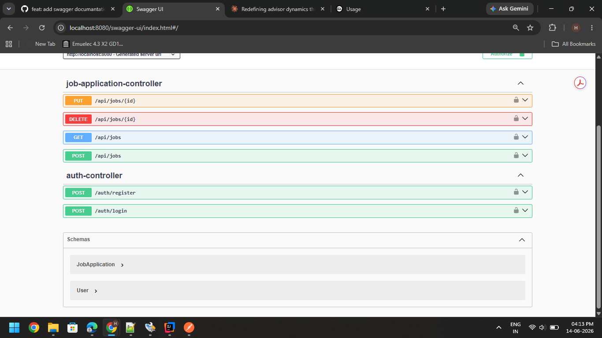
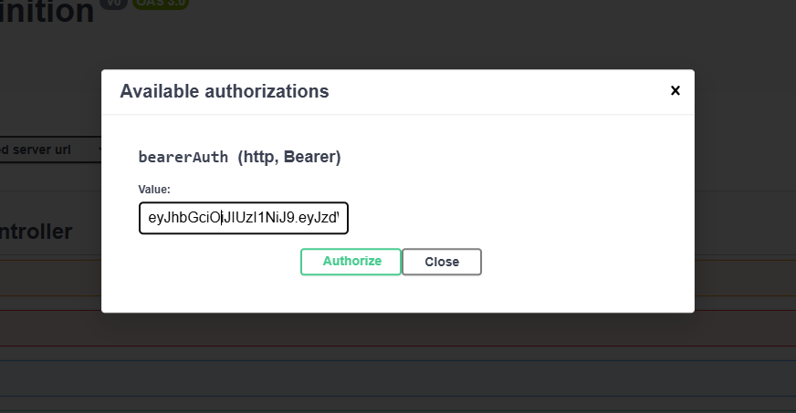
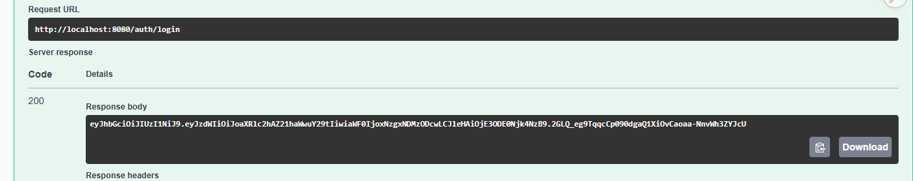
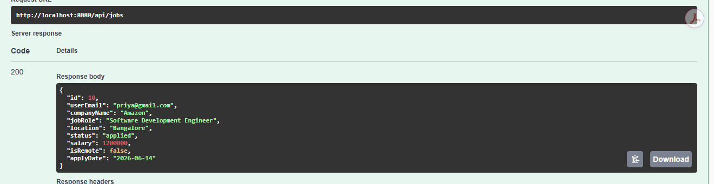
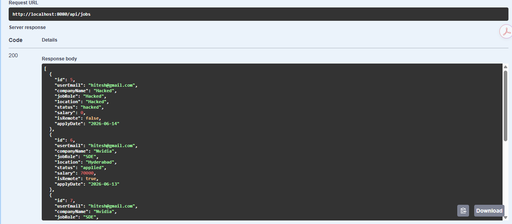
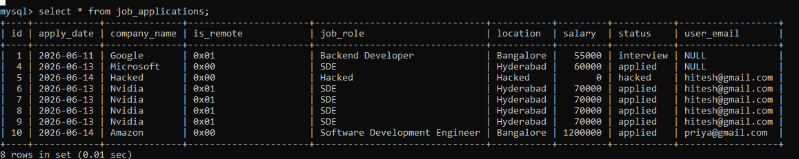
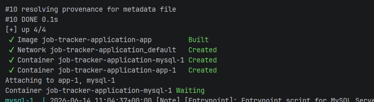
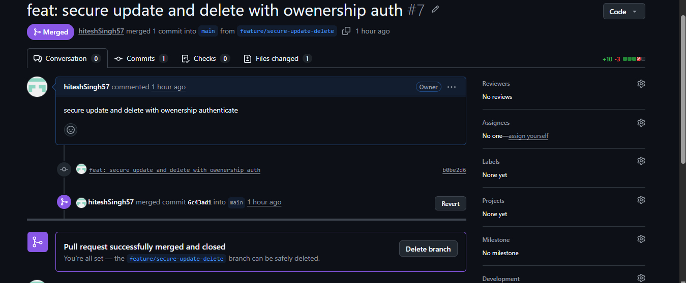

# Job Application Tracker API

A REST API to track job applications with JWT authentication. Built with Spring Boot, MySQL, and Docker.

## Features

- User registration and login with JWT authentication
- User-specific job applications (each user sees only their own data)
- Full CRUD operations — create, read, update, delete job applications
- Password encryption using BCrypt
- API documentation with Swagger UI
- Containerized with Docker and Docker Compose

## Tech Stack

- Java 25
- Spring Boot 3.5
- Spring Security + JWT
- Spring Data JPA + Hibernate
- MySQL 8.0
- Docker & Docker Compose
- Swagger / OpenAPI

## API Endpoints

| Method | Endpoint | Description | Auth Required |
|--------|----------|-------------|----------------|
| POST | `/auth/register` | Register a new user | No |
| POST | `/auth/login` | Login and get JWT token | No |
| GET | `/api/jobs` | Get all jobs for logged-in user | Yes |
| POST | `/api/jobs` | Create a new job application | Yes |
| PUT | `/api/jobs/{id}` | Update a job application | Yes |
| DELETE | `/api/jobs/{id}` | Delete a job application | Yes |

## Screenshots

### Swagger UI


### Authorization


### Login - JWT Token


### Create Job Application


### Get Jobs


### Database


### Docker Running


### Git Workflow


## How to Run Locally

1. Clone the repository
2. Update `application.properties` with your MySQL credentials
3. Run with Docker:
```bash
docker compose up --build
```
4. Access Swagger UI at `http://localhost:8080/swagger-ui/index.html`

## Author

Hitesh Singh